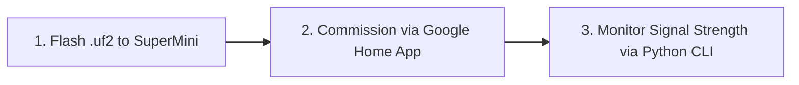

# SuperMini nRF52840 Thread Network Health Checker (Google Home)

Turn your **SuperMini nRF52840** (or nice!nano v2 clone) into an autonomous **Thread Mesh Health Checker & Signal Strength Analyzer** integrated directly into your **Google Home Thread Network**.

The board spoofs a standard **Matter-over-Thread On/Off Light** (`VID: 0xFFF1`, `PID: 0x8000`), allowing the Google Home app on Android to discover it over Bluetooth Low Energy (BLE), pair it, and securely provision your Google Nest Thread Network credentials (PAN ID, Extended PAN ID, Master Key, and Channel) onto the nRF52840 automatically.

Once connected to the Thread mesh, the firmware continuously measures:
* **Real-time Signal Strength**: Average RSSI (dBm), Last Packet RSSI (dBm), Link Margin (dB), and Link Quality Indicator (LQI 0–3 stars) for all mesh neighbors and parents.
* **Mesh Topology & Roles**: Device role (`CHILD`, `ROUTER`, `LEADER`), RLOC16 short address, and Partition ID.
* **Border Router Latency & Health**: Auto-discovers the Google Nest Border Router OMR prefix and measures end-to-end ICMPv6 ping Round-Trip Time (RTT ms) and packet drop rate.
* **USB Serial Diagnostics & CLI**: Streamlined periodic ASCII dashboard and interactive OpenThread CLI passthrough over the SuperMini's native USB-C port.

---

## Hardware Specifications & Safeguards

| Feature | Value / Setting | Notes |
| :--- | :--- | :--- |
| **Microcontroller** | Nordic nRF52840 (Cortex-M4F, 1MB Flash, 256KB RAM) | SuperMini / nice!nano footprint |
| **Bootloader** | Adafruit / nice!nano UF2 | Flashing via double-tap reset drag-and-drop |
| **Flash Partition Offset** | `0x00026000` | Application starts after bootloader to **prevent bricking** |
| **Low-Frequency Clock** | Internal RC Oscillator (`LFRC 32.768 kHz`) | Safe fallback for clone boards lacking 32kHz crystal |
| **Console Interface** | USB CDC ACM Virtual Serial (`cdc_acm_uart0`) | High-speed USB serial (no external FTDI needed) |

---

## Quick Start: 3-Step Setup



### 1. Flash the Board via UF2 Bootloader

1. Connect your SuperMini nRF52840 to your PC using a USB-C data cable.
2. Quickly **double-press the physical RST button** (or short the `RST` pad to `GND` twice).
3. A mass storage drive named **`NICENANO`** or **`NRF52BOOT`** will appear in Windows File Explorer.
4. Drag and drop `supermini_matter_thread_health_checker.uf2` onto the drive.
5. The drive will automatically unmount and the SuperMini will reboot running the Thread Health Checker firmware.

---

### 2. Pair with Google Home (Android)

The firmware is pre-configured with the standard Matter test credentials recognized by Google Play Services:

* **Device Type**: Matter On/Off Light (`0x0100`)
* **Manual Setup Code**: `3497-011-2332`
* **Setup Passcode**: `20202021`
* **Discriminator**: `3840` (`0xF00`)
* **Vendor ID (VID)**: `0xFFF1` (Test VID)
* **Product ID (PID)**: `0x8000` (Test PID)

**Pairing steps:**
1. On your Android phone, enable **Bluetooth** and connect to your home Wi-Fi.
2. Open the **Google Home** app.
3. Tap **`+`** (top left) $\rightarrow$ **`Set up a device`** $\rightarrow$ **`Matter-enabled device`**.
4. When prompted to scan a code:
   * **Either** scan the QR code printed by the companion monitor script or generated in your browser:
     [Generate Matter QR Code](https://api.qrserver.com/v1/create-qr-code/?size=250x250&data=MT:Y.K9042C00KA0648G00)
   * **Or** tap **`Set up without barcode`** and enter the code: **`34970112332`**.
5. Google Home will negotiate PASE over BLE, provision your Nest Thread network credentials, and complete setup!

---

### 3. Run the Python Signal Strength Monitor

The host companion script automatically detects the SuperMini COM port, displays the Matter pairing card, and renders real-time signal strength bars:

```bash
# Install host dependencies
pip install -r tools/requirements.txt

# Run the live monitor (auto-detects COM port)
python tools/thread_monitor.py
```

#### Example Output:
```text
======================================================================
       GOOGLE HOME MATTER COMMISSIONING ASSISTANT
======================================================================
Device Type:       Matter On/Off Light (0x0100)
Vendor / Product:  0xFFF1 (Test VID) / 0x8000 (Test PID)
Discriminator:     3840 (0xF00)
Setup Passcode:    20202021

MANUAL SETUP CODE:  3497-011-2332
Matter QR Payload: MT:Y.K9042C00KA0648G00

======================================================================
[THREAD HEALTH CHECKER - SuperMini nRF52840]
State: ROUTER           | Channel: 15 | PAN ID: 0x4A21
Network Name: Google-Thread-4A21 | RLOC16: 0x3401 | Partition ID: 0x82A1B012
----------------------------------------------------------------------
PARENT LINK: Avg RSSI: -55 dBm | LQI: 3/3 | Link Margin: 35 dB  => [████████░░]  -55 dBm ★★★ (Best)
----------------------------------------------------------------------
NEIGHBOR NODES (2 discovered):
  # | RLOC16 | Extended MAC Address   | Avg RSSI | Last RSSI | Margin | LQI | FER
  1 | 0x3400 | F4:12:FA:01:23:45:67:89 |   -54 dBm |   -52 dBm |  36 dB |  3  | 0.00%  [████████░░]  -52 dBm  ★★★ (Best)
  2 | 0x5802 | E2:34:BC:55:AA:01:22:11 |   -78 dBm |   -79 dBm |  12 dB |  2  | 1.50%  [████░░░░░░]  -79 dBm  ★★☆ (Good)
----------------------------------------------------------------------
GOOGLE NEST BORDER ROUTER: ONLINE | Ping Latency: 18 ms  [Fast RTT: 18 ms]
======================================================================
```

#### Signal Strength Key:
* `[██████████] >= -60 dBm`: **Excellent** (Green) — direct high-throughput link.
* `[████████░░] -61 to -70 dBm`: **Good** (Cyan) — reliable Thread mesh communication.
* `[██████░░░░] -71 to -80 dBm`: **Fair** (Yellow) — acceptable for sleepy end devices.
* `[███░░░░░░░] <= -80 dBm`: **Poor / Weak** (Red) — high packet retries; consider placing another router node nearby.

---

## Interactive OpenThread CLI Commands

You can type OpenThread CLI commands directly into the terminal while `thread_monitor.py` is running:

| Command | Description |
| :--- | :--- |
| `state` | Displays current node role (`detached`, `child`, `router`, `leader`). |
| `neighbor table` | Dumps table of direct 802.15.4 neighbors with detailed link metrics. |
| `router table` | Dumps current Thread router mesh topology and routing costs. |
| `ipaddr` | Lists all assigned IPv6 addresses (Mesh-Local, Link-Local, and Global). |
| `dataset active` | Displays active Thread operational dataset (Channel, PAN ID, Master Key). |
| `ping <ipv6_address>` | Pings any Thread node or external border router address. |
| `counters mac` | Dumps IEEE 802.15.4 frame TX/RX counts, ACK errors, and dropped frames. |

---

## Building from Source

### Option 1: Automated GitHub Actions CI (Recommended)
This repository includes a `.github/workflows/build_uf2.yml` GitHub Actions workflow.
1. Push this directory to your GitHub account.
2. The GitHub Actions runner will boot Nordic's official Docker container (`nordicsemi/nrfconnect-chip:v2.7.0`), compile the project, and automatically publish the `supermini_matter_thread_health_checker.uf2` and `supermini_openthread_cli.uf2` binaries under GitHub Actions **Artifacts**.

### Option 2: Local Compilation with Docker
```bash
docker run --rm -v ${PWD}:/work -w /work nordicsemi/nrfconnect-chip:v2.7.0 bash -c "
  cd /work/firmware &&
  west build -b nice_nano_v2 -d build_matter -- -DEXTRA_DTC_OVERLAY_FILE=boards/supermini_nrf52840.overlay &&
  python3 ../tools/uf2conv.py -c -b 0x26000 -f 0xada52840 build_matter/zephyr/zephyr.hex -o ../supermini_matter_thread_health_checker.uf2
"
```

---

## Recording Telemetry for RF Site Surveys

To survey Thread signal coverage across different rooms in your house, run:

```bash
python tools/thread_monitor.py --log thread_survey.csv
```

Walk around with your laptop and SuperMini. The script logs timestamped RSSI, LQI, and Ping latency to `thread_survey.csv` for dead-zone mapping.
